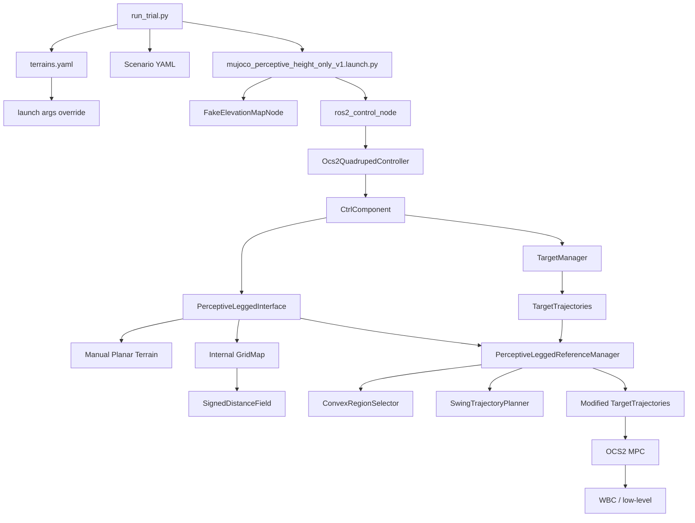

# Height-Only V1 Input Flow

## 목적
이 문서는 `height_only_v1`에서 **가장 처음 입력이 무엇인지**, 그 입력이 **어떤 함수들을 거쳐 변형되는지**, 그리고 **현재 실제 설정값이 서로 맞는지**를 먼저 정리한 것이다.

이 문서의 범위는 `PerceptiveLeggedReferenceManager`보다 앞단까지 포함한다.

즉 지금 보는 대상은:
- MuJoCo terrain / robot spawn
- scenario command
- OCS2 config
- 현재 robot state
- 그리고 이 값들이 `PerceptiveLeggedInterface`와 `TargetManager`를 거쳐 `PerceptiveLeggedReferenceManager`에 도달하는 경로

## 한 줄 요약
현재 `height_only_v1`는 구조상 perceptive 경로를 타지만, 실제 planner가 쓰는 핵심 terrain 입력은 `/elevation_mapping/elevation_map_raw`가 아니라 `task.info`의 `manual_planar_terrain`으로부터 `PerceptiveLeggedInterface.cpp` 안에서 직접 만든

- `floor planar region`
- `box top planar region`
- 내부 `gridMap`
- 내부 `SignedDistanceField`

이다.

반면 `/elevation_mapping/elevation_map_raw`는 현재도 publish되지만, `launch_plane_decomposition=false`라서 planning에는 직접 쓰이지 않는다.

## 1. 최초 입력 정의

### 1.1 MuJoCo world input
실제 박스는 MuJoCo scene에서 정의된다.

파일:
- [eval_height_only_box.xml](/home/ho/unitree_mujoco/unitree_robots/go2/eval_height_only_box.xml)

현재 값:
- box center: `(0.62, 0.0, 0.04)`
- box half-size: `(0.18, 0.55, 0.04)`
- box full size: `(0.36, 1.10, 0.08)`
- box top height: `0.08`

즉 simulator의 실제 obstacle은
- 중심 x가 `0.62`
- 폭 x가 `0.36`
- 폭 y가 `1.10`
- 높이가 `0.08`
인 단일 박스다.

### 1.2 Scenario command input
시나리오는 자동평가 script가 controller에 command를 넣는 방식으로 들어간다.

파일:
- [height_only_box_forward_bootstrap.yaml](/home/ho/ros2_ws/src/quadruped_ros2_control/evaluation/go2_terrain_eval/configs/scenarios/height_only_box_forward_bootstrap.yaml)

현재 값:
1. `enter_ocs2`
   - `2.0s`
   - `command=2`
   - `ly=0.0`
2. `settle`
   - `1.5s`
   - `command=0`
   - `ly=0.0`
3. `enter_gait`
   - `0.5s`
   - `command=3`
   - `ly=0.0`
4. `stabilize_gait`
   - `1.5s`
   - `command=0`
   - `ly=0.05`
5. `forward_over_box`
   - `15.0s`
   - `command=0`
   - `ly=0.70`
6. `stop`
   - `2.0s`
   - `command=2`
   - `ly=0.0`

추가:
- `timeout_sec=28.0`
- `monitoring_start_sec=5.0`

### 1.3 OCS2 config input
OCS2 planner 설정값은 주로 아래 세 파일에서 들어간다.

파일:
- [task.info](/home/ho/ros2_ws/src/quadruped_ros2_control/descriptions/unitree/go2_description_height_only_v1/config/ocs2/task.info)
- [reference.info](/home/ho/ros2_ws/src/quadruped_ros2_control/descriptions/unitree/go2_description_height_only_v1/config/ocs2/reference.info)
- [gait.info](/home/ho/ros2_ws/src/quadruped_ros2_control/descriptions/unitree/go2_description_height_only_v1/config/ocs2/gait.info)

현재 핵심 값:

`task.info`
- `manual_planar_terrain.floor_size_x = 5.0`
- `manual_planar_terrain.floor_size_y = 5.0`
- `manual_planar_terrain.box_center_x = 0.62`
- `manual_planar_terrain.box_center_y = 0.0`
- `manual_planar_terrain.box_size_x = 0.36`
- `manual_planar_terrain.box_size_y = 1.10`
- `manual_planar_terrain.box_height = 0.08`
- `phaseTransitionStanceTime = 0.15`
- `swingHeight = 0.10`
- `contactTimingUncertainty = 0.05`

`reference.info`
- `targetDisplacementVelocity = 0.30`
- `targetRotationVelocity = 0.6`
- `comHeight = 0.36`
- `initialModeSchedule = STANCE -> STANCE`, event time `0.5`

`gait.info`
- `trot switchingTimes = [0.0, 0.40, 0.80]`

### 1.4 Current robot state input
planner가 매 cycle 받는 현재 상태는 estimator/odom 경로로 들어간다.

핵심 파일:
- [CtrlComponent.cpp](/home/ho/ros2_ws/src/quadruped_ros2_control/controllers/ocs2_quadruped_controller_height_only_v1/src/control/CtrlComponent.cpp)

`CtrlComponent::updateState()`
- estimator로 현재 RBD state를 업데이트
- centroidal state로 변환
- 현재 mode도 estimator로부터 받아 observation에 저장
- 이 observation이 `TargetManager`, MPC/MRT 쪽으로 전달된다

## 2. 실제 실행 흐름

## 3. 함수 단위 흐름

### 3.1 실험 시작
파일:
- [run_trial.py](/home/ho/ros2_ws/src/quadruped_ros2_control/evaluation/go2_terrain_eval/scripts/run_trial.py)

`height_only_v1` 모드에서:
- terrain catalog에서 box 위치/크기 값을 읽음
- launch 인자로 전달:
  - `fake_map_mode=box`
  - `terrain_box_center_x`
  - `terrain_box_center_y`
  - `terrain_box_size_x`
  - `terrain_box_size_y`
  - `terrain_box_height`
- 그리고 현재 설정은
  - `launch_fake_elevation_map=true`
  - `launch_plane_decomposition=false`

즉 현재 실험은
- fake elevation map publisher는 켜짐
- plane decomposition pipeline은 꺼짐

### 3.2 launch 단계
파일:
- [mujoco_perceptive_height_only_v1.launch.py](/home/ho/ros2_ws/src/quadruped_ros2_control/controllers/ocs2_quadruped_controller_height_only_v1/launch/mujoco_perceptive_height_only_v1.launch.py)

여기서:
- `fake_elevation_map.launch.py`를 include해서 `/elevation_mapping/elevation_map_raw`를 publish
- `ros2_control_node`를 띄움
- `ocs2_quadruped_controller_height_only_v1`를 spawner로 올림
- `launch_plane_decomposition`이 false라 terrain pipeline include는 생략

### 3.3 raw grid map 생성
파일:
- [FakeElevationMapNode.cpp](/home/ho/ros2_ws/src/quadruped_ros2_control/commands/fake_elevation_map_publisher/src/FakeElevationMapNode.cpp)

현재 `map_mode=box`일 때:
- `map_length_x`, `map_length_y`, `resolution`으로 전체 grid map 생성
- box footprint 내부는 `z_offset + box_height`
- 외부는 `z_offset`
- uncertainty layer도 edge band 주변에서만 생성 가능

현재 launch override 기준 값:
- `map_length_x = 2.8`
- `map_length_y = 1.8`
- `resolution = 0.18`
- `box_center_x = 0.62`
- `box_center_y = 0.0`
- `box_size_x = 0.36`
- `box_size_y = 1.10`
- `box_height = 0.08`

publish topic:
- `/elevation_mapping/elevation_map_raw`

### 3.4 controller 진입
파일:
- [CtrlComponent.cpp](/home/ho/ros2_ws/src/quadruped_ros2_control/controllers/ocs2_quadruped_controller_height_only_v1/src/control/CtrlComponent.cpp)

핵심 함수:
- constructor
- `setupLeggedInterface()`
- `setupMpc()`
- `updateState()`

현재 perceptive 모드이므로:
- `PerceptiveLeggedInterface`를 생성
- 이후 `PerceptiveLeggedReferenceManager`를 쓰는 구조로 간다

### 3.5 PerceptiveLeggedInterface에서 terrain 재구성
파일:
- [PerceptiveLeggedInterface.cpp](/home/ho/ros2_ws/src/quadruped_ros2_control/controllers/ocs2_quadruped_controller_height_only_v1/src/perceptive/interface/PerceptiveLeggedInterface.cpp)

`setupOptimalControlProblem()`에서:
1. `manual_planar_terrain.*` 파라미터 읽음
2. `floor` planar region 생성
3. `box top` planar region 생성
4. 내부 `planarTerrainPtr_->gridMap` 생성
5. layer:
   - `elevation_before_postprocess`
   - `smooth_planar`
6. box footprint 내부 셀은 `boxHeight`로 채움
7. `SignedDistanceField` 계산

중요:
- 여기서 쓰는 terrain은 **외부 `/elevation_mapping/elevation_map_raw`가 아니라 내부 수동 terrain**
- 즉 planning 핵심 입력은 현재 `manual_planar_terrain`

### 3.6 ReferenceManager 구성
같은 파일의 `setupReferenceManager()`에서:
- `SwingTrajectoryPlanner` 생성
- `ConvexRegionSelector` 생성
- `reference.info`의 `comHeight` 읽음
- `PerceptiveLeggedReferenceManager` 생성

즉 `PerceptiveLeggedReferenceManager`의 핵심 입력은:
- `CentroidalModelInfo`
- `GaitSchedule`
- `SwingTrajectoryPlanner`
- `ConvexRegionSelector`
- `EndEffectorKinematics`
- `comHeight`

### 3.7 현재 command가 target trajectory로 바뀌는 곳
파일:
- [TargetManager.cpp](/home/ho/ros2_ws/src/quadruped_ros2_control/controllers/ocs2_quadruped_controller_height_only_v1/src/control/TargetManager.cpp)

`update()`에서:
- `ly`, `lx`, `ry`, `rx`를 읽음
- `cmdGoal[0] = ly * targetDisplacementVelocity`
- body yaw를 반영해서 world-frame velocity 방향으로 회전
- `targetPose` 생성
- `targetPoseToTargetTrajectories()` 호출
- 최종 `ReferenceManager`에 `setTargetTrajectories()`

즉 scenario의 `ly`는 여기서 처음 실제 OCS2 target trajectory로 변환된다.

### 3.8 PerceptiveLeggedReferenceManager에서 reference 수정
파일:
- [PerceptiveLeggedReferenceManager.cpp](/home/ho/ros2_ws/src/quadruped_ros2_control/controllers/ocs2_quadruped_controller_height_only_v1/src/perceptive/interface/PerceptiveLeggedReferenceManager.cpp)

핵심 함수:
- `modifyReferences()`
- `updateSwingTrajectoryPlanner()`

`modifyReferences()`에서:
1. gait schedule을 horizon 기준으로 확장
2. targetTrajectories를 샘플링
3. `ConvexRegionSelector`가 가진 terrain grid map을 읽음
4. base pitch / base z를 terrain에 맞게 수정
5. `convexRegionSelectorPtr_->update(...)`
6. `updateSwingTrajectoryPlanner(...)`

즉 여기서 terrain-aware reference와 foothold/swing 관련 값이 결정된다.

### 3.9 ConvexRegionSelector 역할
파일:
- [ConvexRegionSelector.cpp](/home/ho/ros2_ws/src/quadruped_ros2_control/controllers/ocs2_quadruped_controller_height_only_v1/src/perceptive/interface/ConvexRegionSelector.cpp)

`update()`에서:
- mode schedule에서 contact phase 추출
- 각 stand phase에서 nominal foothold 계산
- 그 foothold를 가장 적절한 planar region으로 projection
- convex polygon과 projection 결과 저장

`getNominalFoothold()`에서 현재 로직:
- x는 `0.15 * measured + 0.85 * desired`
- y는 `0.10 * measured + 0.90 * desired`
- z는 `measured foot z`

즉 box top을 “알고 있다”와 box top을 “실제 다음 foothold로 강하게 선택한다”는 아직 다를 수 있다.

## 4. raw grid map과 manual terrain 중 무엇이 실제로 쓰이는가

### 현재 결론
현재 `height_only_v1` nominal run에서는
- `/elevation_mapping/elevation_map_raw`는 publish됨
- 하지만 `launch_plane_decomposition=false`
- 따라서 그것을 subscribe해서 planning terrain으로 바꾸는 노드는 안 뜸

즉 실제 planning에서 핵심으로 쓰이는 것은:
- `task.info`의 `manual_planar_terrain`
- `PerceptiveLeggedInterface.cpp`가 직접 만든 `planarRegions`
- 내부 `gridMap`
- 내부 `SignedDistanceField`

### raw grid map을 원래 subscribe하는 노드
full perceptive 경로에서는 아래가 구독한다.

파일:
- `/home/ho/ros2_ws/src/ocs2_ros2/submodules/plane_segmentation_ros2/convex_plane_decomposition_ros/src/ConvexPlaneDecompositionRos.cpp`

하지만 현재 실험에서는 launch되지 않는다.

## 5. 현재 실제 값 검증

### 5.1 MuJoCo box vs terrain catalog vs manual terrain
세 군데 값이 서로 맞아야 한다.

검증 결과:

`eval_height_only_box.xml`
- center `(0.62, 0.0, 0.04)`
- half-size `(0.18, 0.55, 0.04)`
- top height `0.08`

`terrains.yaml` `height_only_box`
- `position = [0.62, 0.0, 0.04]`
- `size = [0.36, 1.10, 0.08]`

`task.info`
- `box_center_x = 0.62`
- `box_center_y = 0.0`
- `box_size_x = 0.36`
- `box_size_y = 1.10`
- `box_height = 0.08`

판정:
- **정합은 맞음**

### 5.2 fake map box 파라미터
`run_trial.py`는 `terrains.yaml`의 값을 launch 인자로 넘긴다.
`FakeElevationMapNode.cpp`는 그 값을 그대로 raw grid map에 쓴다.

판정:
- **raw grid map 생성 값도 MuJoCo box와 맞음**

### 5.3 launch 기본값 vs 실제 override
launch 파일 기본값에는
- `terrain_box_center_x = 0.55`
가 들어 있지만,
현재 실험은 `run_trial.py`가 terrain catalog 값을 넘겨서 override한다.

즉 실제 run 값은
- `0.62`

판정:
- **실제 run 값은 맞음**
- 단순 launch default만 보면 오해할 수 있음

### 5.4 Reference / gait / scenario
현재 의도된 nominal baseline 값:
- `targetDisplacementVelocity = 0.30`
- `stabilize_gait.ly = 0.05`
- `forward_over_box.ly = 0.70`
- `forward_over_box.duration = 15.0`
- `stop.command = 2`

판정:
- 이 값들은 최근 startup backstep과 late backward drift를 줄이기 위해 조정된 값이고, 현재 scenario 파일과 config 파일에 실제로 반영돼 있음

### 5.5 실제 결과와의 일치성
파일:
- [result.json](/home/ho/ros2_ws/src/quadruped_ros2_control/evaluation/go2_terrain_eval/results/20260408_201114_height_only_box_height_only_v1_nominal_box_forward15_v1/result.json)

확인된 점:
- startup gait backstep은 거의 0 근처까지 줄어듦
- 하지만 box run에서는 world x보다 lateral drift가 큼
- 즉 초기 입력 정합은 맞지만, 그 다음 planning/foothold 선택 단계에서 box top을 안정적으로 쓰지 못할 가능성이 큼

## 6. 현재 시점의 판단

### 맞다고 판정 가능한 것
1. MuJoCo box geometry와 planner가 믿는 box geometry는 맞다
2. scenario command 값은 의도대로 들어간다
3. `TargetManager`는 `ly`를 target trajectory로 제대로 변환한다
4. `PerceptiveLeggedInterface`는 현재 manual terrain으로 내부 planar terrain/grid/SDF를 직접 만든다

### 아직 맞는지 더 봐야 하는 것
1. `ConvexRegionSelector`가 실제 첫 box step에서 박스 top 내부를 projection 대상으로 고르는지
2. `PerceptiveLeggedReferenceManager`가 base z/pitch를 box 접근 시 의도대로 수정하는지
3. 첫 desired foothold가 box top leading edge를 넘는지
4. first contact after box approach가 성공적인 step-up foothold인지, edge-hit인지

## 7. 다음 단계
이 문서를 기준으로 다음 확인 순서는 이렇다.

1. `PerceptiveLeggedReferenceManager`에 들어가기 직전 입력 정의
   - `TargetTrajectories`
   - `ModeSchedule`
   - `ConvexRegionSelector`의 projection / nominal foothold
2. `PerceptiveLeggedReferenceManager::modifyReferences()` 내부에서
   - base z
   - base pitch
   - swing liftOff/touchDown heights
   가 어떻게 바뀌는지 체크
3. box 접근 시 첫 foothold가 실제 box top 안쪽을 목표로 하는지 확인

## 최종 요약
현재 `height_only_v1`에서 시스템 맨 앞단 입력은
- MuJoCo box terrain
- scenario command
- OCS2 config
- current robot state
이고,

이 중 terrain 관련 최초 입력은 실제로 서로 맞게 세팅돼 있다.

하지만 planning의 실제 병목은 입력 정합이 아니라,
그 다음 단계인
- `ConvexRegionSelector`
- `PerceptiveLeggedReferenceManager`
가 box top을 실제 안정적인 foothold/reference로 만들고 있는지에 있을 가능성이 크다.

## 8. PerceptiveLeggedReferenceManager 직전 입력 정의
여기서는 `PerceptiveLeggedReferenceManager::modifyReferences()`에 들어가기 직전 입력이 무엇인지 정의한다.

핵심 함수:
- [PerceptiveLeggedReferenceManager.cpp](/home/ho/ros2_ws/src/quadruped_ros2_control/controllers/ocs2_quadruped_controller_height_only_v1/src/perceptive/interface/PerceptiveLeggedReferenceManager.cpp)
- [PerceptiveLeggedReferenceManager.h](/home/ho/ros2_ws/src/quadruped_ros2_control/controllers/ocs2_quadruped_controller_height_only_v1/include/ocs2_quadruped_controller/perceptive/interface/PerceptiveLeggedReferenceManager.h)

시그니처:
- `modifyReferences(initTime, finalTime, initState, targetTrajectories, modeSchedule)`

즉 입력은 5개다.

1. `initTime`
2. `finalTime`
3. `initState`
4. `targetTrajectories`
5. `modeSchedule` 출력용 참조

그리고 클래스 생성 시 이미 고정 입력으로 들어가 있는 것은:
1. `CentroidalModelInfo`
2. `GaitSchedule`
3. `SwingTrajectoryPlanner`
4. `ConvexRegionSelector`
5. `EndEffectorKinematics`
6. `comHeight`

### 8.1 TargetTrajectories는 어디서 오나
파일:
- [TargetManager.cpp](/home/ho/ros2_ws/src/quadruped_ros2_control/controllers/ocs2_quadruped_controller_height_only_v1/src/control/TargetManager.cpp)
- [TargetManager.h](/home/ho/ros2_ws/src/quadruped_ros2_control/controllers/ocs2_quadruped_controller_height_only_v1/include/ocs2_quadruped_controller/control/TargetManager.h)

흐름:
1. scenario `ly/lx/rx/ry`가 `ctrl_component_.control_inputs_`로 들어옴
2. `TargetManager::update()`에서
   - `cmdGoal[0] = ly * targetDisplacementVelocity`
   - `cmdGoal[1] = -lx * targetDisplacementVelocity`
   - `cmdGoal[3] = -rx * targetRotationVelocity`
3. 현재 yaw를 반영해 world-frame 속도로 회전
4. `targetPoseToTargetTrajectories()`에서 2-node trajectory 생성

현재 실제 값:
- `targetDisplacementVelocity = 0.30`
- `time_to_target = mpc.timeHorizon = 1.0`
- 현재 forward step에서 `ly = 0.70`

따라서 command-active 구간의 nominal x velocity input은:
- `0.70 * 0.30 = 0.21 m/s`

즉 `PerceptiveLeggedReferenceManager`로 들어오는 `targetTrajectories`는
- 현재 시각
- 1초 뒤 목표 pose
를 잇는 2-point reference trajectory이다.

판정:
- **정의상 맞음**
- 지금 forward command가 실제로 0이 아니라, nominal target trajectory로 제대로 바뀌고 있음

### 8.2 ModeSchedule은 어디서 오나
파일:
- [LeggedInterface.cpp](/home/ho/ros2_ws/src/quadruped_ros2_control/controllers/ocs2_quadruped_controller_height_only_v1/src/interface/LeggedInterface.cpp)
- [SwitchedModelReferenceManager.cpp](/home/ho/ros2_ws/src/quadruped_ros2_control/controllers/ocs2_quadruped_controller_height_only_v1/src/interface/SwitchedModelReferenceManager.cpp)
- [GaitManager.cpp](/home/ho/ros2_ws/src/quadruped_ros2_control/controllers/ocs2_quadruped_controller_height_only_v1/src/control/GaitManager.cpp)

흐름:
1. `reference.info`에서 initial mode schedule을 읽음
   - 현재 `STANCE -> STANCE`
2. `gait.info`에서 gait templates를 읽음
   - 현재 `trot = [0.0, 0.40, 0.80]`
3. `GaitManager`가 scenario의 `command` 값을 보고 gait template를 insert
   - `command=3`이면 `trot`
4. `PerceptiveLeggedReferenceManager::modifyReferences()` 안에서
   - `getGaitSchedule()->getModeSchedule(...)`
   를 다시 불러 horizon 기반 mode schedule 생성

즉 `PerceptiveLeggedReferenceManager`로 들어가는 `modeSchedule`은
- scenario command
- gait template
- current horizon
를 반영한 결과다.

판정:
- **현재 시나리오 구조와 gait 파일은 일치함**
- startup drift를 줄이기 위한 `stabilize_gait.ly=0.05`는 gait template가 아니라 target trajectory 쪽 조정이다

### 8.3 initState는 어디서 오나
파일:
- [CtrlComponent.cpp](/home/ho/ros2_ws/src/quadruped_ros2_control/controllers/ocs2_quadruped_controller_height_only_v1/src/control/CtrlComponent.cpp)

흐름:
1. estimator가 measured RBD state 추정
2. centroidal state로 변환
3. yaw unwrap
4. `observation.state`가 MPC/MRT 쪽으로 전달

즉 `initState`는 현재 robot의 centroidal state다.

판정:
- 이 값은 우리가 file 값만으로 미리 단정할 수 없고, run-time 관측값이다
- 따라서 이후 단계에서 별도 계측 또는 로그 확인이 필요

### 8.4 ConvexRegionSelector는 어떤 입력을 갖고 있나
파일:
- [ConvexRegionSelector.cpp](/home/ho/ros2_ws/src/quadruped_ros2_control/controllers/ocs2_quadruped_controller_height_only_v1/src/perceptive/interface/ConvexRegionSelector.cpp)

생성 시 고정 입력:
1. `CentroidalModelInfo`
2. `planarTerrainPtr`
3. `EndEffectorKinematics`
4. `numVertices`

현재 `planarTerrainPtr`의 실제 내용:
- floor region
- box top region
- internal gridMap
- internal SDF

`update()` 시 추가 입력:
1. `modeSchedule`
2. `initTime`
3. `initState`
4. `targetTrajectories`

즉 `PerceptiveLeggedReferenceManager`가 호출되기 전 이미
`ConvexRegionSelector`는 다음의 모든 재료를 가진다.
- 현재 gait phase
- 현재 robot state
- nominal target trajectory
- floor/box terrain geometry

판정:
- 입력 구성은 논리적으로 맞음
- 다만 실제 병목은 이 selector가 박스 top을 **실제 foothold target으로 충분히 강하게 선택하느냐**에 있을 가능성이 큼

### 8.5 comHeight 입력
파일:
- [reference.info](/home/ho/ros2_ws/src/quadruped_ros2_control/descriptions/unitree/go2_description_height_only_v1/config/ocs2/reference.info)

현재 값:
- `comHeight = 0.36`

이 값은 `PerceptiveLeggedReferenceManager` 생성자에서 그대로 들어간다.
`modifyReferences()`에서는 terrain height와 결합해 base z lower bound를 정하는 데 쓰인다.

판정:
- 현재 nominal 기준값으로는 일관됨

## 9. PerceptiveLeggedReferenceManager 직전 입력 판정

### 맞다고 볼 수 있는 것
1. `targetTrajectories`
   - scenario `ly`와 `targetDisplacementVelocity`가 일관되게 반영됨
2. `modeSchedule`
   - `reference.info` initial mode + `gait.info` template + scenario command가 일관되게 반영됨
3. `ConvexRegionSelector`의 terrain 입력
   - floor + box top geometry가 simulator와 일치함
4. `comHeight`
   - file 값과 constructor 입력이 일치함

### 아직 실제 run-time에서 더 봐야 하는 것
1. `initState`
   - run-time state이므로 실제 박스 접근 순간 값 확인 필요
2. `ConvexRegionSelector` output
   - 첫 front-leg foothold projection이 box top 안쪽인지 확인 필요
3. `PerceptiveLeggedReferenceManager` output
   - base pitch / base z / swing touchdown heights가 의도대로 바뀌는지 확인 필요

## 10. Runtime 확인 결과: `refmgr_debug_v1`

결과 폴더:
- [result.json](/home/ho/ros2_ws/src/quadruped_ros2_control/evaluation/go2_terrain_eval/results/20260409_205257_height_only_box_height_only_v1_refmgr_debug_v1/result.json)
- [height_only_reference_debug.log](/home/ho/ros2_ws/src/quadruped_ros2_control/evaluation/go2_terrain_eval/results/20260409_205257_height_only_box_height_only_v1_refmgr_debug_v1/height_only_reference_debug.log)

### 10.1 전체 결과
주요 값:
- `body_frame_forward_progress ≈ 0.0788`
- `command_active_body_frame_forward_progress ≈ 0.1175`
- `body_frame_lateral_progress ≈ 0.0879`
- `start_pose = (-0.0801, 0.0000, 0.1165)`
- `end_pose = (-0.0012, 0.0879, 0.3725)`

판정:
- nominal은 약간 전진했지만 lateral drift도 큼
- world x 기준으로는 박스 중심 `x=0.62`에 전혀 도달하지 못함

### 10.2 `PerceptiveLeggedReferenceManager` query 값
대표 로그:
- `[HeightOnlyRef] init_t=4.392 query_t=4.892 pos=(-0.0801,0.0000,0.3605) uncertainty=0.00000 terrain_trust=1.00000 terrain_pitch=0.00000 blended_pitch=-0.05000 smooth_height=0.00000 terrain_height=0.36045 final_base_z=0.36045`
- `[HeightOnlyRef] init_t=32.459 query_t=32.959 pos=(-0.0013,0.0879,0.3600) uncertainty=0.00000 terrain_trust=1.00000 terrain_pitch=0.00000 blended_pitch=0.00000 smooth_height=0.00000 terrain_height=0.36000 final_base_z=0.36000`

판정:
- query 위치에서 `smooth_height`는 계속 `0.0`
- `terrain_pitch`도 `0.0`
- 즉 base reference 관점에서는 **박스 top을 아직 전혀 보지 못한 상태**

이건 ReferenceManager가 잘못 계산했다기보다,
query하는 base 위치 자체가 아직 floor 영역에 머무르고 있다는 뜻이다.

### 10.3 `ConvexRegionSelector` foothold projection 값
대표 로그:
- `[HeightOnlySelector] ... leg=0 nominal=(0.1294,0.1529,0.0642) projected=(0.1294,0.1529,0.0000)`
- `[HeightOnlySelector] ... leg=1 nominal=(0.1294,-0.1529,0.0642) projected=(0.1294,-0.1529,0.0000)`
- `[HeightOnlySelector] ... leg=2 nominal=(-0.2988,0.1700,0.0636) projected=(-0.2988,0.1700,0.0000)`
- `[HeightOnlySelector] ... leg=3 nominal=(-0.2988,-0.1700,0.0636) projected=(-0.2988,-0.1700,0.0000)`

후반 로그도 동일 패턴:
- nominal x는 대체로 `-0.30 ~ +0.19`
- projection z는 계속 `0.0`

현재 box top x 범위:
- `0.62 ± 0.18`
- 즉 `x ∈ [0.44, 0.80]`

판정:
- 이번 run에서 `ConvexRegionSelector`는 **한 번도 box top 영역으로 projection하지 않았다**
- 즉 `PerceptiveLeggedReferenceManager`에 들어가는 foothold-related 입력은 모두 floor 기반이었다

### 10.4 swing height sequence 값
대표 로그:
- `[HeightOnlySwing] ... projected=(0.1320,0.1529,0.0642) liftoff_h=0.00000 touchdown_h=0.00000`

판정:
- swing touchdown/liftoff height도 전부 `0.0`
- 즉 swing planner 역시 box top touchdown을 전혀 계획하지 않았다

## 11. 현재까지의 최종 판정

이번 `refmgr_debug_v1` 기준으로는:

1. **최초 입력 정합은 맞다**
   - MuJoCo box, terrain catalog, manual terrain 파라미터는 서로 일치

2. **`PerceptiveLeggedReferenceManager` 직전 입력도 논리적으로 맞다**
   - target trajectory
   - gait schedule
   - convex region selector
   - com height

3. **하지만 이번 run에서는 box top 관련 입력 자체가 `PerceptiveLeggedReferenceManager`까지 오지 않았다**
   - selector projection z가 전부 `0.0`
   - swing touchdown height도 전부 `0.0`
   - reference manager query terrain height도 전부 `0.0`

즉 이 run 기준 문제는:
- `PerceptiveLeggedReferenceManager`가 box top 입력을 잘못 처리했다기보다
- 그 앞단에서 **box top이 후보 foothold / terrain query 영역으로 아예 들어오지 못했다**
는 쪽에 더 가깝다.
