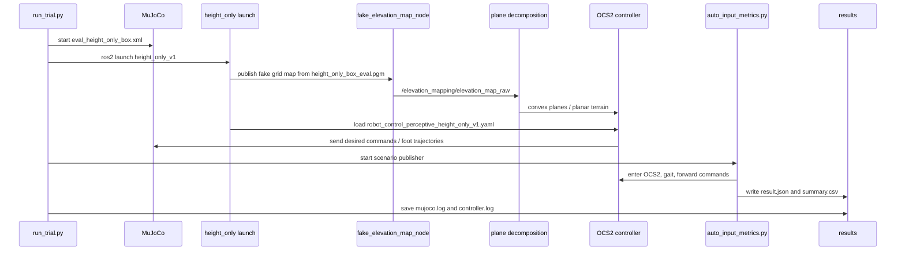

# Height-Only V1 Overview

## Summary

This path is a new simplified experiment stack for:

- single-box MuJoCo terrain
- fake height-only perception
- GO2 OCS2 perceptive controller in a separate package
- later: contact timing uncertainty `+-d`

It is intentionally separate from the older `test1` and `uncertainty_v1` paths.

## File Relationships

```mermaid
flowchart TD
    A[run_trial.py<br/>mode=height_only_v1] --> B[terrains.yaml<br/>height_only_box]
    A --> C[height_only_box_forward_bootstrap.yaml]
    A --> D[ros2 launch<br/>mujoco_perceptive_height_only_v1.launch.py]
    A --> E[MuJoCo scene<br/>eval_height_only_box.xml]

    B --> F[height_only_box_eval.pgm]
    B --> E

    D --> G[go2_description_height_only_v1]
    D --> H[ocs2_quadruped_controller_height_only_v1]
    D --> I[fake_elevation_map.launch.py]
    D --> J[elevation_mapping_height_only_v1.launch.py]

    G --> K[robot_control_perceptive_height_only_v1.yaml]
    G --> L[xacro/robot.xacro]
    G --> M[config/ocs2/task.info]
    G --> N[config/ocs2/reference.info]
    G --> O[config/ocs2/gait.info]

    H --> P[Ocs2QuadrupedController]
    H --> Q[PerceptiveLeggedInterface]
    H --> R[PerceptiveLeggedReferenceManager]
    H --> S[ConvexRegionSelector]
    H --> T[PerceptiveLeggedPrecomputation]

    I --> F
    I --> U[/elevation_mapping/elevation_map_raw]
    J --> U
    J --> V[convex plane decomposition]
    V --> P

    E --> W[MuJoCo robot + contacts]
    W --> P
    C --> X[auto_input_metrics.py]
    X --> Y[result.json / summary.csv]
    A --> Y
```

## Runtime Order



## Main Files

- Trial runner:
  - `/home/ho/ros2_ws/src/quadruped_ros2_control/evaluation/go2_terrain_eval/scripts/run_trial.py`
- New terrain catalog entry:
  - `/home/ho/ros2_ws/src/quadruped_ros2_control/evaluation/go2_terrain_eval/configs/terrains.yaml`
- New simple scenario:
  - `/home/ho/ros2_ws/src/quadruped_ros2_control/evaluation/go2_terrain_eval/configs/scenarios/height_only_box_forward_bootstrap.yaml`
- Fake height image:
  - `/home/ho/ros2_ws/src/quadruped_ros2_control/evaluation/go2_terrain_eval/assets/height_only_box_eval.pgm`
- MuJoCo box scene:
  - `/home/ho/unitree_mujoco/unitree_robots/go2/eval_height_only_box.xml`
- New controller package:
  - `/home/ho/ros2_ws/src/quadruped_ros2_control/controllers/ocs2_quadruped_controller_height_only_v1`
- New description package:
  - `/home/ho/ros2_ws/src/quadruped_ros2_control/descriptions/unitree/go2_description_height_only_v1`

## What Is Simplified

- Terrain is reduced to a single box.
- Perception is reduced to a fake height image.
- The experiment currently reuses the existing fake grid-map path instead of a richer perception stack.
- The future plan is to replace or augment this with direct height-value injection and contact timing perturbation.

## Current Known Issue

The first nominal height-only run launched correctly, but the robot did not stand/walk well enough. This means:

- package / launch wiring is now alive
- the benchmark is not yet dynamically usable
- next fixes should focus on:
  - robot spawn position relative to the box
  - fake map alignment and range
  - initial gait / stand-up quality
